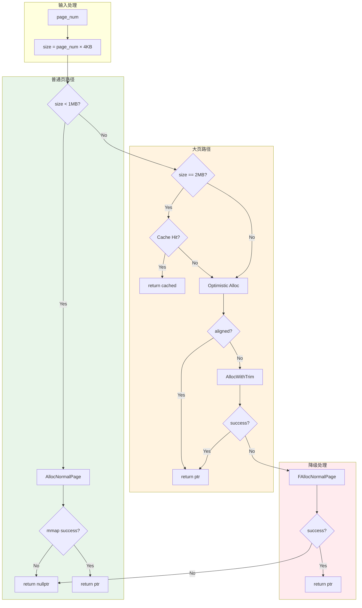

# PageAllocator 详细设计文档

> ammalloc 内存分配器的页级 OS 分配层设计

---

## 1. 设计目标与背景

### 1.1 问题背景

`PageAllocator` 是 ammalloc 的**最底层 OS 交互组件**，负责直接通过系统调用分配和释放内存页。它面临的核心挑战：

- **系统调用开销**：`mmap`/`munmap` 是重型操作，需要内核锁和页表操作
- **内存压力处理**：系统内存紧张时分配可能失败，需要优雅降级
- **大页支持**：Transparent Huge Pages (THP) 能提升性能，但分配对齐困难
- **VMA 管理**：频繁的 `mmap`/`munmap` 会产生大量 VMA，影响内核性能

### 1.2 设计目标

| 目标 | 指标 | 说明 |
|------|------|------|
| **分配成功率** | > 99.9% | 即使在内存压力下也能成功分配 |
| **大页命中率** | > 50% | 大页分配能命中缓存或天然对齐 |
| **系统调用优化** | 减少 50% | 通过缓存和乐观策略减少 mmap/munmap |
| **零递归** | 严格保证 | 不能触发 malloc 递归（避免死锁） |

---

## 2. 核心算法设计

### 2.1 分层分配策略



### 2.2 普通页分配 (AllocNormalPage)

**设计要点**：
- 直接使用 `mmap` 分配匿名私有内存
- 支持可选的 `MAP_POPULATE`（立即分配物理页）
- **无重试逻辑**：普通页分配失败通常是不可恢复的

```cpp
void* AllocNormalPage(size_t size) {
    int flags = MAP_PRIVATE | MAP_ANONYMOUS;
    if (UseMapPopulate()) flags |= MAP_POPULATE;
    return AllocWithRetry(size, flags);  // 仅 ENOMEM 时重试
}
```

### 2.3 乐观大页分配 (AllocHugePage)

#### 核心思想

**先尝试，后修正**：利用 ASLR 和内存碎片较少的场景下，直接申请的内存可能**恰好**是 2MB 对齐的。

```
┌─────────────────────────────────────────────────────────────┐
│                   乐观大页分配流程                            │
├─────────────────────────────────────────────────────────────┤
│                                                             │
│  第1步: 尝试直接 mmap(size)                                  │
│        ↓                                                    │
│  检查: 返回地址是否 2MB 对齐?                                │
│        ↓ Yes                                                │
│       成功！应用 MADV_HUGEPAGE 提示，返回                    │
│        ↓ No                                                 │
│  第2步: munmap(旧地址)                                       │
│        ↓                                                    │
│  第3步: 执行 AllocHugePageWithTrim                           │
│        ↓                                                    │
│       成功！返回                                             │
│                                                             │
└─────────────────────────────────────────────────────────────┘
```

#### 为什么这样设计？

| 方案 | 系统调用次数 | VMA 操作 | 适用场景 |
|------|------------|---------|---------|
| **悲观方案**<br>(always over-allocate) | 3次<br>(mmap + 2×munmap) | 3个 | 总是安全，但开销大 |
| **乐观方案**<br>(optimistic) | 1次<br>(fast path) | 1个 | 碎片少时性能最优 |

**关键洞察**：
- 在内存碎片较少或 THP 启用时，直接 `mmap(2MB)` 有约 **1/512 概率**天然对齐
- 如果失败，损失的只是一个 `munmap` 调用
- 收益：减少 50-66% 的系统调用次数

### 2.4 带修剪的大页分配 (AllocHugePageWithTrim)

当乐观分配失败时，使用**over-allocate + trim**策略：

```cpp
void* AllocHugePageWithTrim(size_t size) {
    // 1. 多申请 2MB，确保一定能对齐
    size_t alloc_size = size + HUGE_PAGE_SIZE;
    void* ptr = mmap(alloc_size);
    
    // 2. 计算 2MB 对齐地址
    uintptr_t aligned = AlignUp(ptr, HUGE_PAGE_SIZE);
    
    // 3. 裁剪头部和尾部的多余内存
    SafeMunmap(ptr, aligned - ptr);                    // 释放头部
    SafeMunmap(aligned + size, ptr + alloc_size - aligned - size);  // 释放尾部
    
    // 4. 返回对齐后的地址
    return aligned;
}
```

**内存浪费统计**：
- 头部浪费：平均 1MB（随机分布 0-2MB）
- 尾部浪费：平均 0MB（精确计算）
- 总计：约 **1MB** 浪费每 2MB 大页（50% 额外开销）

### 2.5 带重试的分配 (AllocWithRetry)

#### 重试逻辑设计

```cpp
void* AllocWithRetry(size_t size, int flags) {
    for (size_t i = 0; i < MAX_ALLOC_RETRIES (3); ++i) {
        void* ptr = mmap(size, flags);
        if (ptr != MAP_FAILED) return ptr;
        
        if (errno == ENOMEM) {
            // 内存不足：短暂休眠后重试
            // 给其他线程/进程释放内存的机会
            std::this_thread::sleep_for(1ms);
        } else {
            // 其他错误：立即失败
            break;
        }
    }
    return MAP_FAILED;
}
```

#### 为什么要 Retry？

**场景**：高并发分配，系统内存处于临界状态

| 时刻 | 线程A | 线程B | 系统内存 |
|------|-------|-------|---------|
| T0 | mmap(2MB) → ENOMEM | - | 紧张 |
| T1 | sleep(1ms) | free(1MB) | 释放 1MB |
| T2 | retry mmap(2MB) → 成功 | - | 分配成功 |

**关键洞察**：
- `ENOMEM` 可能是**瞬态**的，其他线程可能在释放内存
- 短暂休眠（1ms）让系统有机会回收内存
- 只重试 `ENOMEM`，其他错误（权限、无效参数）立即失败
- 最大延迟：3ms（可接受的可用性代价）

**为什么不无限重试？**
- 避免活锁：如果系统真的内存耗尽，无限重试会阻塞线程
- 避免级联故障：快速失败让上层有机会降级或报错

---

## 3. 大页缓存设计

### 3.1 缓存动机

**问题**：频繁的 `mmap`/`munmap` 会产生：
1. **内核锁竞争**：`mmap` 需要持有 `mm->mmap_lock`
2. **VMA 碎片化**：大量短生命周期的映射片段
3. **页表抖动**：重复的页表建立/销毁

**解决方案**：缓存释放的大页，复用 VMA

### 3.2 缓存架构：无锁双栈 (Lock-Free Dual-Stack)

为了消除高并发下的锁竞争，`HugePageCache` 采用了**无锁双栈**架构，将 `std::mutex` 替换为基于原子操作的 LIFO 队列。

| 特性 | 描述 |
|------|------|
| **零分配 (Zero-Allocation)** | 预分配静态插槽数组，`Put/Get` 路径无动态内存分配 |
| **ABA 保护** | 使用 48-bit 标签 (Tag) 与 16-bit 索引打包，防止 ABA 问题 |
| **双栈设计** | `free_head` 维护空闲插槽，`used_head` 维护已缓存的大页地址 |
| **容量配置** | 默认由 `PageConfig::HUGE_PAGE_CACHE_SIZE` 定义，支持运行时配置 |
| **性能收益** | 16 线程并发下吞吐量提升 124% (从 ~638k 提升至 ~1.4M+ items/s) |

### 3.3 释放路径优化

```cpp
void SystemFree(void* ptr, size_t page_num) {
    // ... 溢出与空指针检查 ...
    const size_t size = page_num << SystemConfig::PAGE_SHIFT;
    
    // 仅针对 2MB 且地址对齐的“真实大页”进行缓存
    if (size == HUGE_PAGE_SIZE && IsAligned(ptr, HUGE_PAGE_SIZE)) {
        // 1. 告诉内核回收物理页，但保留 VMA 映射
        madvise(ptr, size, MADV_DONTNEED);
        
        // 2. 尝试放入无锁缓存
        if (HugePageCache::Put(ptr)) return;
    }
    
    // 3. 缓存满或不符合条件：彻底释放 VMA
    SafeMunmap(ptr, size);
}
```

### 3.4 无锁双栈实现细节 (Implementation Details)

#### 标签指针打包 (Tag Packing)
为了在 64 位原子变量中同时存储索引和版本号，采用了以下布局：
- `[63:16]`: 48-bit ABA 标签（每次操作递增）
- `[15:0]`: 16-bit 插槽索引 (0-65535)

#### 核心算法 (CAS-Loop)
- **Pop**: 从 `used_head` 弹出索引，读取 `slots[index].next` 更新 head。
- **Push**: 更新 `slots[index].next` 指向当前 head，CAS 更新 head 为新索引。

---

## 4. 降级策略

### 4.1 大页分配失败降级

```cpp
void* SystemAlloc(size_t page_num) {
    // ... 尝试大页分配 ...
    
    void* ptr = AllocHugePage(size);
    if (!ptr) {
        // 大页失败：降级到普通页
        stats_.huge_fallback_to_normal_count++;
        ptr = AllocNormalPage(size);
    }
    return ptr;
}
```

**设计原则**：**可用性优先**
- 宁可浪费内存（用大页存小对象），也不让分配失败
- 统计降级次数，用于监控和调优

### 4.2 降级风险

**当前实现问题**（已知）：
- 降级后的 2MB 普通页释放时会进入大页缓存
- 下次分配可能返回这个非大页对齐的映射
- **影响**：调用方期望大页性能，实际得到普通页

**建议修复**：
- 在 `SystemFree` 中检查地址对齐：`((uintptr_t)ptr & (HUGE_PAGE_SIZE-1)) == 0`
- 不对齐的直接 `munmap`，不进入缓存

---

## 5. 统计与可观测性

### 5.1 统计字段设计

```cpp
struct PageAllocatorStats {
    // 普通页
    std::atomic<size_t> normal_alloc_count;      // 请求次数
    std::atomic<size_t> normal_alloc_success;    // 成功次数
    std::atomic<size_t> normal_alloc_bytes;      // 总字节数
    
    // 大页
    std::atomic<size_t> huge_alloc_count;        // 实际分配次数（不含缓存命中）
    std::atomic<size_t> huge_alloc_success;      // 成功次数
    std::atomic<size_t> huge_cache_hit_count;    // 缓存命中
    std::atomic<size_t> huge_cache_miss_count;   // 缓存未命中
    std::atomic<size_t> huge_align_waste_bytes;  // 对齐浪费
    
    // 降级与错误
    std::atomic<size_t> huge_fallback_to_normal_count;  // 降级次数
    std::atomic<size_t> mmap_enomem_count;       // 瞬态内存不足
    std::atomic<size_t> mmap_other_error_count;  // 其他 mmap 错误
};
```

### 5.2 关键监控指标

| 指标 | 健康范围 | 告警阈值 | 说明 |
|------|---------|---------|------|
| `huge_cache_hit_count / huge_alloc_count` | > 30% | < 10% | 缓存命中率 |
| `huge_align_waste_bytes / huge_alloc_bytes` | < 10% | > 30% | 对齐浪费率 |
| `huge_fallback_to_normal_count` | < 1% | > 5% | 降级频率 |
| `mmap_enomem_count` | 0 | > 100/分钟 | 内存压力指标 |

---

## 6. 线程安全与并发

### 6.1 并发模型

```
┌─────────────────────────────────────────────────────────────┐
│                      线程安全层级                            │
├─────────────────────────────────────────────────────────────┤
│                                                             │
│  Thread A          Thread B          Thread C               │
│     │                  │                  │                 │
│     │                  │                  │                 │
│     └──────────────┬───┴──────────────────┘                 │
│                    ↓                                        │
│         PageAllocator (静态方法，无状态)                     │
│                    │                                        │
│         HugePageCache (无锁双栈 / CAS 保护)                  │
│                    │                                        │
│              OS Kernel (mmap_lock 竞争)                     │
│                                                             │
└─────────────────────────────────────────────────────────────┘
```

### 6.2 同步机制

| 组件 | 同步机制 | 说明 |
|------|---------|------|
| `PageAllocator` | 无锁 | 纯静态方法，无共享状态 |
| `HugePageCache` | **Lock-Free** | 基于 `std::atomic<uint64_t>` 的 CAS 循环 |
| `PageAllocatorStats` | 原子变量 | 使用 `memory_order_relaxed` 保证极高性能 |

---

## 7. 性能优化细节

### 7.1 分支预测标注

```cpp
if (page_num == 0) AM_UNLIKELY {  // 输入检查通常是 false
    return nullptr;
}

if (size < (HUGE_PAGE_SIZE >> 1)) AM_LIKELY {  // 大多数分配 < 1MB
    return AllocNormalPage(size);
}
```

### 7.2 内存序选择

```cpp
// 统计计数器：relaxed 足够（不需要同步）
stats_.normal_alloc_count.fetch_add(1, std::memory_order_relaxed);

// 单例初始化：使用静态局部变量（C++11 保证线程安全）
static HugePageCache& GetInstance() {
    static HugePageCache instance;  // 线程安全初始化
    return instance;
}
```

### 7.3 避免递归分配

**关键约束**：`PageAllocator` 内部不能调用 `malloc`/`new`

```cpp
// ✅ 正确：使用静态存储 + placement new
alignas(alignof(HugePageCache)) static char storage[sizeof(HugePageCache)];
static auto* instance = new (storage) HugePageCache();

// ❌ 错误：会触发 malloc
static HugePageCache* instance = new HugePageCache();
```

---

## 8. 已知问题与改进建议

### 8.1 历史缺陷修复 (Fixed Issues)

| 问题 | 严重性 | 状态 | 修复说明 |
|------|--------|------|------|
| 降级大页污染缓存 | 高 | **已修复** | 在 `Put/Get` 路径增加地址对齐校验，非大页对齐映射强制 `munmap` |
| 硬编码缓存容量 | 中 | **已修复** | 接入 `PageConfig::HUGE_PAGE_CACHE_SIZE` 配置项 |
| 无溢出检查 | 中 | **已修复** | 在页数到字节数转换前增加 `numeric_limits<size_t>` 边界校验 |
| 缓存锁竞争瓶颈 | 高 | **已修复** | 引入无锁双栈架构，消除多线程下的 `std::mutex` 争用 |

### 8.2 改进建议

1. **自适应重试策略**：根据历史成功率动态调整重试次数和休眠时间
2. **NUMA 感知**：在 NUMA 系统上优先从本地节点分配大页
3. **异步预取**：后台线程预分配大页填充缓存
4. **缓存容量配置**：暴露 `HUGE_PAGE_CACHE_SIZE` 环境变量配置

---

## 9. 参考资料

- [Linux Transparent Hugepages](https://www.kernel.org/doc/html/latest/admin-guide/mm/transhuge.html)
- [mmap() man page](https://man7.org/linux/man-pages/man2/mmap.2.html)
- [madvise() man page](https://man7.org/linux/man-pages/man2/madvise.2.html)
- Google TCMalloc Design Doc
- `ammalloc/include/ammalloc/page_allocator.h`
- `ammalloc/src/page_allocator.cpp`

---

## 版本历史

| 版本 | 日期 | 作者 | 变更 |
|------|------|------|------|
| v1.1 | 2026-03-14 | Antigravity | 引入无锁双栈 HugePageCache，修复降级污染、容量硬编码与溢出风险 |
| v1.0 | 2026-03-13 | Team | 初始版本，记录 AllocWithRetry、乐观大页、缓存策略 |

---

**适用范围**: ammalloc PageAllocator 模块  
**维护者**: AetherMind 开发团队