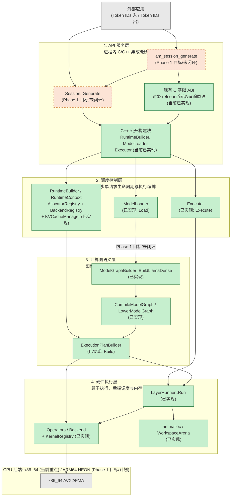
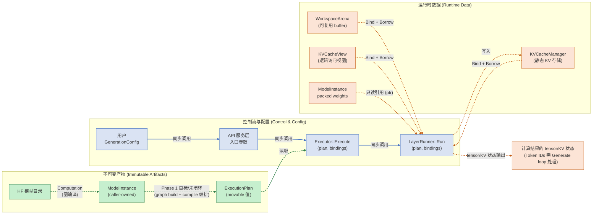
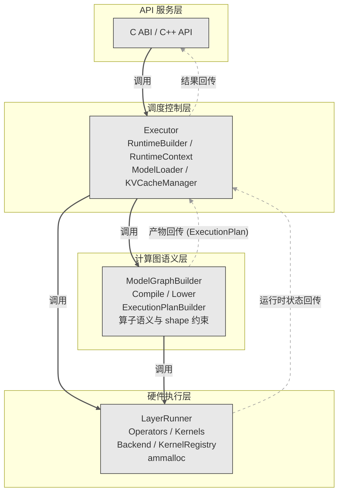

# AetherMind 系统架构总览

## 系统架构总览

AetherMind Phase 1 的代码组织遵循四个**概念责任层**。这四个层是逻辑上的责任边界，**不是**源文件目录结构的一对一映射（例如 `src/execution/` 中的代码会在多个层中出现职责交叉，但概念上属于"调度控制层"或其支撑设施）。



---

> 说明：上图刻意省略"结果向上回传"的虚线边，以突出**单一方向的数据流**。层间结果回传（如 `ExecutionPlan` 由计算图语义层产出后交调度控制层持有）属于所有权关系，详见第五节与第六节的依赖规则图。

---

## 一、API 服务层 (API Service Layer)

### 定位

API 服务层是 AetherMind **进程内**集成/服务边界。它不是 HTTP/gRPC 服务端点，也不是网络协议层。它定义的是外部应用（C/C++ 宿主程序）如何通过 Token IDs 接口调用推理引擎。

> **重中之重"不是"**：API 服务层不包含 HTTP/gRPC 服务、不包含异步/流式 API、不包含 tokenizer。所有输入输出均为 `uint32_t` Token ID 数组。

### 职责

| 维度 | 说明 |
|------|------|
| **责任** | 定义生命周期契约（Runtime、Model、Session 的创建与销毁）；暴露同步生成入口；封装内部错误为稳定错误码；维护 ABI 稳定性 |
| **当前模块** | `include/c_api.h`（当前仅提供对象 refcount、错误处理与 traceback 原语）；公开 C++ 头文件中的构建块（`RuntimeBuilder`、`ModelLoader`、`Executor`） |
| **主要输入** | 模型路径、`GenerationConfig`（max_tokens, eos_token_id）、Prompt Token ID 数组 |
| **主要输出** | 输出 Token ID 数组、`am_error_t` 错误信息 |
| **目标缺口** | `Session::Generate` 完整方法、`am_session_generate` C ABI 生成函数尚未完整实现；当前公开 API 为底层构建块而非一站式生成入口 |
| **禁止责任泄漏** | 不得包含 HTTP/gRPC 服务、不得做 tokenizer 操作、不得做请求排队、不得做异步回调、不得暴露推理内部状态机 |

> 当前 API 服务层呈现为"底层构建块"形态：调用方可以使用 `RuntimeBuilder` 装配运行时、`ModelLoader::Load` 加载模型、`Executor::Execute` 执行单计划，但 `Session::Generate` 这样的一站式生成入口属于 Phase 1 目标。PRD 定义的 `am_session_generate` C ABI（`am_session_t` + `uint32_t*` 输入输出）与 `Session::Generate`（`vector<uint32_t>` → `vector<uint32_t>`）是后续冻结目标。

---

## 二、调度控制层 (Dispatch & Control Layer)

### 定位

调度控制层负责**同步单请求生命周期管理与执行编排**。它不处理请求调度、admission control、队列或批处理。它的核心任务是在一次推理请求的生命周期内，协调资源绑定、执行计划调度和状态推进。

> **关键区分**：此处的"调度"是指执行步骤的编排调度（单请求内如何按序执行 Prefill/Decode 及其子步骤），而非多请求间的负载调度。

### 职责

| 维度 | 说明 |
|------|------|
| **责任** | 管理 Runtime 资源（Allocator、Backend、KVCacheManager）的装配；维护执行期间上下文绑定；协调 Prefill→Decode→Finish 状态机；驱动 KV Cache 与 Workspace 的绑定与释放 |
| **当前模块** | `RuntimeBuilder`、`RuntimeContext`、`Executor`、`KVCacheManager`、`RuntimeBindingContext`、`ModelLoader` |
| **主要输入** | 已编译的 `ExecutionPlan`、`ModelInstance` 句柄（caller-owned）、Prompt Token 序列、`GenerationConfig` |
| **主要输出** | 执行步骤结果（tensor 写入 workspace / KV cache 位置）；Token IDs 需由目标 Generate 循环在 Argmax/stop handling 后产生 |
| **目标缺口** | `PrefillPath`/`DecodePath` 类未实现；`Executor::Generate` 完整状态机未实现；当前 `Executor::Execute` 为单计划一次性执行，不具备跨步骤状态管理和 Prefill/Decode 阶段区分能力 |
| **禁止责任泄漏** | 不得承担请求排队/批处理、不得处理网络 IO、不得承担算子级 dispatch 决策（仅为调用方） |

> 当前 `Executor::Execute` 的实现是单一 plan 遍历执行：调用 `LayerRunner::Run` 按序执行每个 `ExecutionStep`，每步经 workspace 绑定、KernelContext 构造、shape 约束校验后调用 `step.op->Run`（当前 `Operator::Run` 为虚函数调用，但 `Prepare()` 阶段已将 `ResolvedKernel::fn` 缓存，执行路径避免 registry 查找）。整个 Generate 状态机（PrepareSession → Prefill → Decode loop → Argmax/stop）属于 Phase 1 目标。

---

## 三、计算图语义层 (Computational Graph Layer)

### 定位

计算图语义层消费已经加载并校验的模型配置与权重语义，将模型拓扑构建为语义图（`ModelGraph`），再经过优化和降低（lowering）生成可供执行计划构建使用的表示。

### 职责

| 维度 | 说明 |
|------|------|
| **责任** | 基于已解析的模型配置与权重语义构建 Llama dense 语义图；执行图优化 passes（常量折叠、SiLU-Mul 融合、死代码消除）；lowering 为算子级 node spec；构建不可变的 `ExecutionPlan` |
| **当前模块** | `ModelGraphBuilder`、`CompileModelGraph` / `OptimizeModelGraph` / `LowerModelGraph`、`ExecutionPlanBuilder` |
| **主要输入** | `ModelInstance` 中的模型配置与 resolved weights |
| **主要中间产物** | `ModelInstance`（config + resolved weights + packed weights，由 `ModelLoader::Load` 产生，caller-owned） → `ModelGraph`（语义 DAG） → `CompiledModelGraph`（optimized graph + `LoweredGraph`） → `ExecutionPlan`（不可变 step 序列） |
| **主要输出** | `ExecutionPlan`（已 resolve kernel fn + packed weight ptr + workspace requirement） |
| **目标缺口** | `ModelInstance` → graph building → compile pipeline → `ExecutionPlan` 的完整生产级端到端连接尚未闭环。当前节点规格主要由 lowering bridge 或测试手工构造 |
| **禁止责任泄漏** | 不得承担执行期资源绑定（如 workspace 地址绑定是调度控制层的职责）；不得承担运行时算子调度；不得处理 Token IDs |

> `ExecutionPlanBuilder` 是一个层边界适配器：它消费计算图语义层产出的 `LoweredGraph`（节点规格列表），然后向硬件执行层的 Backend 发起 kernel resolve 请求，将结果冻结为 `ExecutionPlan`。计划构建本身由计算图语义层发起，kernel resolve 能力由硬件执行层暴露。

### 模型加载 + 图编译数据流

```mermaid
flowchart LR
    A["HF 模型目录<br/>(config.json + *.safetensors)"] -->|"当前已实现"| B["ModelLoader::Load<br/>(返回 caller-owned<br/>unique_ptr&lt;ModelInstance&gt;)"]

    B -->|"返回 ModelInstance<br/>含 config + resolved weights"| C["ModelInstance"]

    C -.->|"Phase 1 目标/未闭环<br/>当前生产入口尚未闭合<br/>测试/手工构造为主"| D["ModelGraphBuilder::BuildLlamaDense<br/>(模型独立，当前已实现)"]

    D -->|"当前已实现"| E["ModelGraph<br/>(语义 DAG)"]

    subgraph CG["CompileModelGraph (当前已实现)"]
        direction LR
        F["OptimizeModelGraph<br/>(O0/O1/O2+ passes)"] --> G["optimized ModelGraph"]
        G --> H["LowerModelGraph"]
        H --> I["LoweredGraph<br/>(ExecutionPlanNodeSpec[])"]
    end

    E --> F
    I -->|"ExecutionPlanBuilder::Build<br/>(层边界适配器, 已实现)"| J["ExecutionPlan<br/>ExecutionStep[]<br/>(kernel fn resolved,<br/>packed weight ptr bound,<br/>workspace req frozen)"]

    J -.->|"Phase 1 目标/未闭环<br/>接入目标 Generate 管线"| K["Session::Generate"]

    classDef impl fill:#c6efce,stroke:#2d7d46
    classDef tgt fill:#fce4d6,stroke:#c55a11,stroke-dasharray:5 5

    class A,B,C,D,E,F,G,H,I,J impl
    class K tgt
```



---

## 四、硬件执行层 (Hardware Execution Layer)

### 定位

硬件执行层是距离 CPU 硬件最近的层次。它不关心模型拓扑或请求语义，只负责一件事：**在给定的后端（目前是 CPU）上，按照已经冻结的执行计划，高效地执行算子 kernel**。

### 职责

| 维度 | 说明 |
|------|------|
| **责任** | 暴露 kernel resolve 能力（供 `ExecutionPlanBuilder` 在 plan-build-time 调用）；注册与选择后端 kernel；在工作空间绑定和 shape 校验后执行逐步骤算子调用；提供 workspace 复用与 KV cache 物理访问契约 |
| **当前模块** | `LayerRunner`、`CpuBackend`、`KernelRegistry`（全局 singleton + `AM_REGISTER_KERNEL` 静态注册）、各算子 Op（`RmsNormOp` 等，`Operator::Run` 当前为虚函数，`Prepare()` 阶段缓存 `ResolvedKernel::fn`）、`WorkspaceArena`、`ammalloc` |
| **主要输入** | `ExecutionPlan`（已 resolve 的 `ExecutionStep` 序列）、`RuntimeBindingContext`（workspace base、KV view 等动态绑定） |
| **主要输出** | 各 step 计算结果的 tensor 写入（workspace + KV cache 位置）；Token IDs 仅在目标 Generate 循环经 Argmax 处理后产生 |
| **目标缺口** | CPU backend/kernel dispatch 已通过 plan-build-time resolve 就位；更完整的 Llama layer 算子覆盖和 SIMD 优化 kernel 仍在推进 |
| **禁止责任泄漏** | 不得感知模型拓扑、不得承担请求编排、不得在热路径做 registry/hash/string lookup（当前 `Operator::Run` 虽为虚函数，但已避免热路径 registry 查找）、不得将宽对象（`RuntimeContext*`）下放给 kernel |

> kernel resolve 能力由硬件执行层暴露（通过 `Backend::ResolveKernel` 接口），但 resolve 的发起方是计算图语义层的 `ExecutionPlanBuilder`——这是典型的层边界适配模式：能力由下层提供，决策由上层做出。

### 执行阶段调用序列

以下时序图展示 Prefill/Decode 阶段的执行流。**所有带参与者交互的完整 Generate、Prefill 计划、Decode 循环、Argmax/stop 编排消息均为 Phase 1 目标行为**。当前已实现的原语仅限于底层的 `Executor::Execute(plan, bindings) -> LayerRunner::Run(plan, bindings)` 单计划遍历执行。

```mermaid
sequenceDiagram
    participant App as 外部应用
    participant API as API 服务层 (目标)
    participant Exec as 调度控制层 (目标 Generate)
    participant LR as 硬件执行层
    participant KV as KVCacheManager

    Note over App, KV: 以下 Generate 编排均为 Phase 1 目标

    App->>API: am_session_generate(token_ids, config)
    API->>Exec: Session::Generate(prompt, config)

    Note over Exec: PrepareSession: 绑定 KV slot + workspace

    Exec->>KV: KVCacheManager::ReserveForSession(prompt_len, max_new_tokens)
    KV-->>Exec: KVCacheView (逻辑视图)

    rect rgb(200, 230, 200)
        Note over Exec,LR: Prefill (Phase 1 目标, 层间消息示意)
        Exec->>LR: LayerRunner::Run(prefill_plan, bindings)
        Note over LR: 全量 prompt 各层前向 → 写入 KV
        LR-->>Exec: Status::Ok()
        Note over Exec: Argmax 选出首 token
    end

    rect rgb(230, 230, 200)
        Note over Exec,LR: Decode Loop (Phase 1 目标)
        loop DecodeStep
            Exec->>LR: LayerRunner::Run(decode_step_plan, bindings)
            Note over LR: 单 token 各层前向 → 读写 KV
            LR-->>Exec: Status::Ok()
            Note over Exec: Argmax + Stop Check
        end
    end

    Exec-->>API: vector<uint32_t> output_tokens
    API-->>App: output_tokens + finish_reason

    Note over Exec,LR: 当前已实现: Executor::Execute(plan, bindings) → LayerRunner::Run(plan, bindings)
    Note over LR: LayerRunner 不直接输出 Token IDs; Token 由目标 Generate loop 产生
```

---

## 五、控制流/配置 vs 产物 vs 运行时数据

系统中有三类本质不同的信息，它们的来源、生命周期和访问方式各不相同。以下流程图用三种不同的箭头区分它们：



箭头含义：

| 箭头样式 | 含义 | 示例 |
|----------|------|------|
| 蓝色实线 | 控制流 — 同步函数调用/参数传递 | App → API → Executor → LayerRunner |
| 绿色虚线 | 计算 — 产物产生过程（一次性编译） | HF 目录 → `ModelInstance` → `ExecutionPlan` |
| 橙色点线 | 运行期绑定/借用 — 不拥有生命周期 | workspace binding、KV view 绑定、packed weight 指针引用 |

### 所有权与生命周期宏观规则

| 类别 | 生命周期 | 可变性 | 持有者 |
|------|----------|--------|--------|
| `ModelInstance` (config + weights + packed weights) | 模型生命周期（长） | 准备阶段可写，执行阶段按只读使用 | Caller-owned (`unique_ptr<ModelInstance>`); 模型级生命周期管理是目标架构关切 |
| `ExecutionPlan`（`ExecutionStep[]`） | 模型生命周期（长） | 构建后不可变 | Movable 值对象，由调用方/模型管理方持有；模型级生命周期所有权是目标架构关切 |
| `RuntimeContext`（AllocatorRegistry + BackendRegistry + KVCacheManager） | Runtime 生命周期（长） | 装配后基本不可变 | 调用方持有 `RuntimeBuilder::Build()` 返回的值对象 |
| Workspace arena | Session 生命周期（中） | 可变（reset 后复用） | 调用方或后端资源对象持有；`RuntimeBindingContext` 仅借用指针 |
| `KVCacheView` | Session 生命周期（中） | 视图可复制，底层 KV 状态可变 | `RuntimeBindingContext` 保存视图；存储由 `KVCacheManager` 持有 |
| 单次 kernel 调用的 tensor view / binding | step 执行期间（短） | 可变（不拥有存储） | 栈帧 / `KernelContext` |

---

## 六、层依赖规则与不变量

### 依赖方向

AetherMind 的代码依赖规则是**自上而下单向依赖**，允许上层调用下层接口，禁止下层反向依赖上层。



### 规则说明

**硬规则（编译期/设计期检查）**：

1. **API 服务层仅依赖调度控制层暴露的集成边界**，不得绕过控制层直接操作图编译或硬件执行细节（如 kernel 函数指针）。当前底层 C++ 构建块是未闭环阶段的工程入口，不代表最终公共 API 依赖形态。
2. **调度控制层不可见 API 服务层细节**。`Executor` 不知道调用方是 C ABI 还是 C++ API。
3. **计算图语义层不可见调度控制层**。`ModelGraphBuilder` 不知道 `Executor` 如何执行它的产物。
4. **硬件执行层不可见 API 服务层与调度控制层的高层抽象**。Kernel 函数不允许持有 `RuntimeContext*`、`SessionState*` 等宽对象指针。
5. **不可变产物的所有权由上游持有**：当前 `ModelInstance` 与 `ExecutionPlan` 由调用方或模型管理侧持有，硬件执行层只消费引用。

**软规则（设计原则）**：

6. 结果向上回传、调用向下传递。下层从不"向上查找"或依赖上层类型。
7. 层间通过窄接口（struct、span、function pointer）通信，避免传递高层抽象类型。

### 为什么这样分层

| 关注点 | 收益 |
|--------|------|
| **可测试性** | 每层可独立测试：`ExecutionPlanBuilder` 不依赖 `Executor`；`LayerRunner` 不依赖模型加载；Kernel 函数不依赖 Runtime 上下文 |
| **热路径效率** | kernel 执行通过 plan-build-time resolve 的 `ResolvedKernel::fn` 函数指针完成（`Operator::Run` 当前为虚函数包装，但已避免热路径 registry 查找）；`LayerRunner` 的步骤遍历循环体轻量，无层间抽象开销 |
| **可替换性** | 后端感知的差异通过 `KernelSelector`、Backend 与 `KernelRegistry` 收敛在计划构建和硬件执行边界，避免向 API 泄漏；这只是隔离能力，不代表 Phase 1 支持非 CPU 后端 |
| **演进边界** | 后续阶段若引入批处理、PagedAttention 或非 CPU 后端，需要重新评估相应层内模块；四层边界用于局部化变化，不构成兼容性或交付承诺 |

---

## 七、关键产物与数据流向

### 关键产物与数据移动说明

| 阶段 | 输入 → 输出 | 关键事实 |
|------|-------------|----------|
| **模型加载** | HF 目录 → caller-owned `ModelInstance` | `ModelLoader::Load` 返回 `unique_ptr<ModelInstance>`；含 config、resolved weights、prepacked weights |
| **图构建** | `ModelInstance` → `ModelGraph`（语义 DAG） | `ModelGraphBuilder::BuildLlamaDense` 构建 dense decoder 的算子 DAG |
| **图编译** | `ModelGraph` → `CompiledModelGraph { optimized_graph, lowered }` | `CompileModelGraph` 统一封装 optimize + lower；其中 `LoweredGraph` 包含 `ExecutionPlanNodeSpec[]` |
| **计划构建** | `LoweredGraph` → 不可变 `ExecutionPlan` | `ExecutionPlanBuilder` 向硬件层发起 kernel resolve，绑定 packed weight 指针，冻结 workspace requirement |
| **执行** | `ExecutionPlan` → tensor/KV 状态 | `Executor::Execute` → `LayerRunner::Run` 按步执行；每步经 workspace 绑定、shape 校验后调用算子。Token IDs 由目标 Generate 循环经 Argmax 处理后产生 |

---

## 八、当前实现 vs Phase 1 目标差距概要

| 维度 | 当前实现了什么 | Phase 1 目标/未闭环 | Phase 1 边界外 |
|------|----------------|---------------------|----------------|
| **API** | `c_api.h` 中的对象 refcount、错误处理与 traceback 原语 | `Session::Generate` 完整方法、`am_session_generate` C ABI 函数 | HTTP/gRPC 服务、tokenizer、异步/流式 API |
| **模型加载** | `ModelLoader::Load`（HF 配置验证、权重加载 resolve、`ModelInstance` 创建、权重预打包） | 闭环的 ModelInstance → Generate 管线 | MoE、encoder-decoder、sliding window attention |
| **图编译** | `ModelGraphBuilder::BuildLlamaDense`、`CompileModelGraph`（optimize + lower）、`LoweredGraph` | 生产级 ModelInstance → ExecutionPlan 自动入口（当前测试/手工构造 node spec 为主） | - |
| **计划构建** | `ExecutionPlanBuilder::Build`（kernel resolve + packed weight bind + workspace plan） | - | - |
| **执行引擎** | `Executor::Execute` → `LayerRunner::Run`（单一 plan 按步执行） | PrefillPath / DecodePath 状态机、Generate 编排 | Continuous batching、request scheduling |
| **KV Cache** | `KVCacheManager`（静态预分配 Init + ReserveForSession）、`KVCacheView`（逻辑读写） | 接入 Generate 的完整 Prefill/Decode KV 读写流 | PagedAttention、动态扩容 |
| **采样** | Argmax（通过算子体系） | 集成到 Generate 循环 | Temperature / top-k / top-p |
| **Backend** | CPU Backend（`CpuBackend` factory/freeze/resolve、`KernelRegistry` 全局 singleton + `AM_REGISTER_KERNEL`） | 更完整的 Llama-layer 算子覆盖与 SIMD kernel | GPU/CUDA、CANN |
| **内存** | `ammalloc`（ThreadCache/CentralCache/PageCache）、`WorkspaceArena`（Bind/Reset） | Decode 稳态零分配验证 | - |

当前状态机完整度已在第二节中注明：当前能力为 `Executor::Execute → LayerRunner::Run` 单计划遍历执行；完整 `Generate` 状态机（PrepareSession → Prefill → Decode loop → Argmax/stop → output tokens）属于 Phase 1 目标。

---

## 九、Phase 1 边界速查

| 包含 | 排除 |
|------|------|
| Token IDs 输入/输出 | ❌ 字符串/文本输入输出 |
| CPU-only 后端（x86_64 AVX2/FMA 当前重点; ARM64 NEON Phase 1 目标/计划） | ❌ GPU/CUDA 后端 |
| 同步单请求执行 | ❌ 异步/流式 API |
| 贪婪采样（Argmax） | ❌ Temperature / Top-K / Top-P |
| 静态预分配 KV Cache | ❌ PagedAttention / 动态 Cache |
| `config.json` + `*.safetensors` 模型加载 | ❌ Tokenizer 集成 |
| Llama 家族 Dense 模型 | ❌ MoE / Encoder-Decoder |
| 进程内 C/C++ API | ❌ HTTP/gRPC 服务接口 |
| 单请求生命周期管理 | ❌ 请求调度 / Continuous Batching |
| 推理引擎内部接口 | ❌ 外部服务治理、A/B 测试 |

---

## 十、参考来源

本文档的所有"当前实现"状态均基于以下代码与设计文档。当前状态以源代码为准，Phase 1 目标以 PRD 为准。

### 关键代码路径

| 路径 | 对应模块 |
|------|----------|
| [`include/aethermind/model/model_loader.h`](../../../include/aethermind/model/model_loader.h) / [`src/model/model_loader.cpp`](../../../src/model/model_loader.cpp) | `ModelLoader::Load` |
| [`include/aethermind/model/graph/graph_builder.h`](../../../include/aethermind/model/graph/graph_builder.h) / [`src/model/graph/graph_builder.cpp`](../../../src/model/graph/graph_builder.cpp) | `ModelGraphBuilder::BuildLlamaDense` |
| [`src/model/graph/compilation/graph_compiler.cpp`](../../../src/model/graph/compilation/graph_compiler.cpp) | `CompileModelGraph`, `OptimizeModelGraph` |
| [`include/aethermind/execution/execution_plan_builder.h`](../../../include/aethermind/execution/execution_plan_builder.h) / [`src/execution/execution_plan_builder.cpp`](../../../src/execution/execution_plan_builder.cpp) | `ExecutionPlanBuilder::Build` |
| [`include/aethermind/execution/executor.h`](../../../include/aethermind/execution/executor.h) / [`src/execution/executor.cpp`](../../../src/execution/executor.cpp) | `Executor::Execute` |
| [`include/aethermind/execution/layer_runner.h`](../../../include/aethermind/execution/layer_runner.h) / [`src/execution/layer_runner.cpp`](../../../src/execution/layer_runner.cpp) | `LayerRunner::Run` |
| [`include/aethermind/runtime/runtime_builder.h`](../../../include/aethermind/runtime/runtime_builder.h) / [`src/runtime/runtime_builder.cpp`](../../../src/runtime/runtime_builder.cpp) | `RuntimeBuilder::Build` |
| [`include/aethermind/execution/kv_cache_manager.h`](../../../include/aethermind/execution/kv_cache_manager.h) / [`src/execution/kv_cache_manager.cpp`](../../../src/execution/kv_cache_manager.cpp) | `KVCacheManager` |
| [`include/aethermind/model/model_instance.h`](../../../include/aethermind/model/model_instance.h) / [`src/model/model_instance.cpp`](../../../src/model/model_instance.cpp) | `ModelInstance` |
| [`include/aethermind/runtime/runtime_context.h`](../../../include/aethermind/runtime/runtime_context.h) | `RuntimeContext` |

### 关键设计文档

| 文档 | 覆盖内容 |
|------|----------|
| [`../../products/aethermind_prd.md`](../../products/aethermind_prd.md) | Phase 1 产品需求、验收标准、边界定义 |
| [`../graph_compilation_flow.md`](../graph_compilation_flow.md) | 图编译流程（ModelGraph → LoweredGraph → ExecutionPlan）的详细实现追踪 |
| [`../backend_design.md`](../backend_design.md) | Backend 层三阶段执行模型（注册/构建/执行）、CPU Backend 设计 |
| [`../dispatch_design.md`](../dispatch_design.md) | Dispatch 模块（全局 KernelRegistry + AM_REGISTER_KERNEL + plan-build-time resolve） |
| [`../executor_design.md`](../executor_design.md) | Executor 设计（Prefill/Decode 状态机、SessionState、ExecContext、LayerRunner 骨架） |

### 维护规则

1. **源代码证明当前状态**。本文档中的"当前已实现"标记在编写时已验证源代码与测试文件。如有偏差，以代码行为为准。
2. **PRD 定义 Phase 1 目标状态**。`docs/products/aethermind_prd.md` 是 Phase 1 功能需求与验收标准的唯一权威来源。
3. **本文档为宏观架构总览**，不替代具体模块的详细设计文档。各模块的精确接口、数据结构与设计决策请查阅对应的设计文档。
4. **当发现本文档与代码不符时**，请更新本文档以反映当前代码事实，或在 PR 中标注偏离，而非修改代码去迎合文档。
